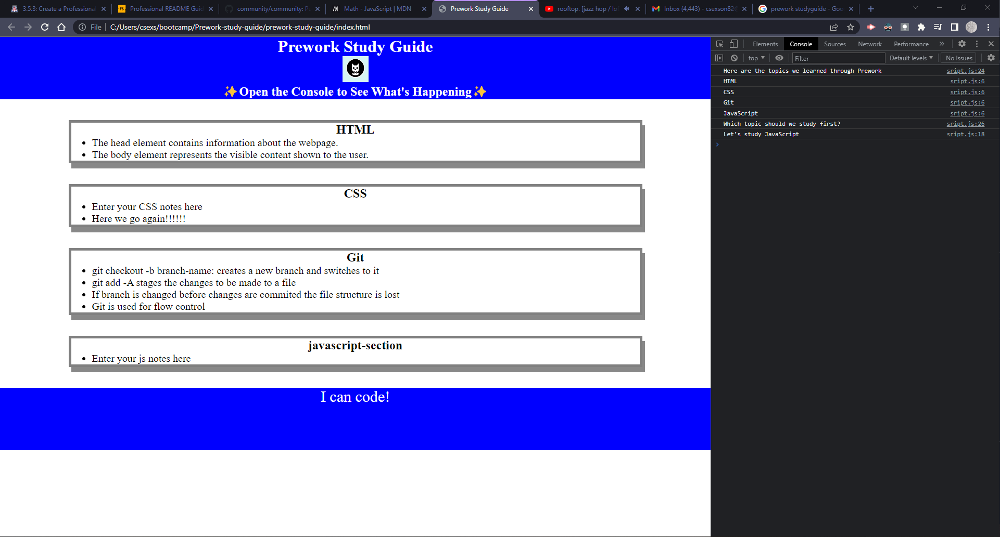

# PreWork Study Guide 

## Description

This is a web based study guide that is designed to give hands on instruction for building a functional webpage to store notes ono sections covered.

- My motivation for this was that the prework lookedd like a good way to begin the boot camp with confidence.

- I built this project because it was an opportunity to practice with the technologies I will need to be familiar with in the boot camp.

- This will be a good solution to store notes about the subjects that I've learned as a part of this prework for reference later on.

- I have mainly learned how to use JavaScript and link external sources to my webpage.

## Usage

Open index.html in Google Chrome.  Select "More Tools" from the Chrome menu, then select "developer tools".  
A pannel should open on the left side or below the webpage.  
Make sure that console is selected at the top of the pane.  
You should see a list of subjects covered in this prework along with a random suggestion for what to study next.  
The suggestion will change everytime you load the page.

## Credits

N/A

## License

Refer to license info in repo.